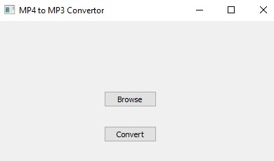

## MP4 to MP3 convertor

Perhaps one of the most useful tool for a lot of Video editors or Music Lovers. 

Steps to run the App

`pip install -r requirements.txt`
`python main.py`

### Results

Current State
 

